# 基础环境配置与zookeeper安装

## 1.修改主机名

本次集群搭建共有三个节点，包括一个主节点master，和两个从节点slave1和slave2。     
1.以主机点master为例，首次切换到root用户：su     
2.分别修改三台主机名为master，slave1，slave2：    

* `hostnamectl set-hostname master`
* `hostnamectl set-hostname slave1`
* `hostnamectl set-hostname slave2`

    
3.永久修改主机名，编辑/etc/sysconfig/network文件，内容如下：    
在master的network文件中加入以下内容：    

```
NETWORKING=yes
HOSTNAME=master
```

在slave1的network中加入以下内容：   

```
NETWORKING=yes
HOSTNAME=slave1
```

在slave2的network中加入以下内容：   

```
NETWORKING=yes
HOSTNAME=slave2
```
 

注意保存退出。
     
4.保存该文件，重启计算机：`reboot`    
5.查看是否生效：`hostname`  

## 2.配置host文件  

使各个节点能使用对应的节点主机名连接对应的地址。     
　　hosts文件主要用于确定每个结点的IP地址，方便后续各结点能快速查到并访问。在上述3个虚机结点上均需要配置此文件。由于需要确定每个结点的IP地址，所以在配置hosts文件之前需要先查看当前虚机结点的IP地址是多少.    
　　1.可以通过ifconfig命令进行查看。    
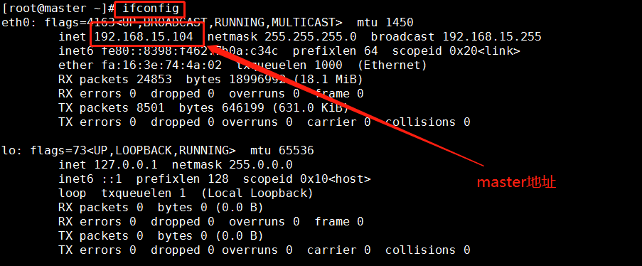 
    
　　2.查看节点地址之后将三个节点的ip地址以及其对应的名称写进hosts文件。这里我们设置为master、slave1、slave2。注意保存退出。

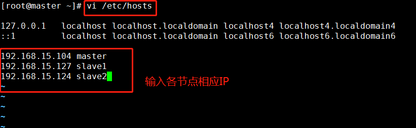 

## 3.关闭防火墙

centos7中防火墙命令用firewalld取代了iptables，当其状态是dead时，即防火墙关闭。

* 关闭防火墙：`systemctl stop firewalld`
* 查看状态：`systemctl status firewalld`

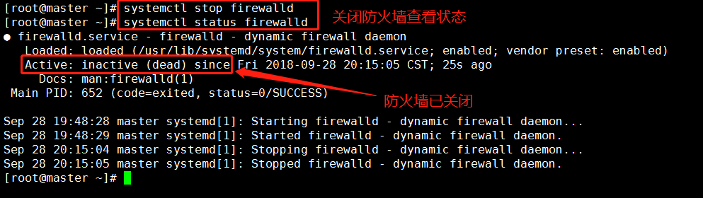 

## 4.时间同步   

1. 首先在时间同步之前确认是否有网络连接，如果没有网络只需要在每台机器上都输入 date -s 10:00 就可以将所有机器时间同步到10:00了，但是在有网络的情况下就可以执行下面的这种时间同步的方法：       
　　时区一致。要保证设置主机时间准确，每台机器时区必须一致。实验中我们需要同步网络时间，因此要首先选择一样的时区。先确保时区一样，否则同步以后时间也是有时区差。    
可以使用date查看自己的机器时间。  

    

2.选择时区：`tzselect`  

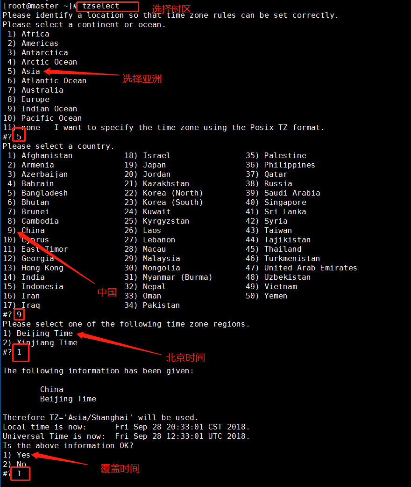  


由于hadoop集群对时间要求很高，所以集群内主机要经常同步。我们使用ntp进行时间同步，master作为ntp服务器，其余的当做ntp客户端。

3.下载ntp（三台机器）  

`yum install –y ntp`  

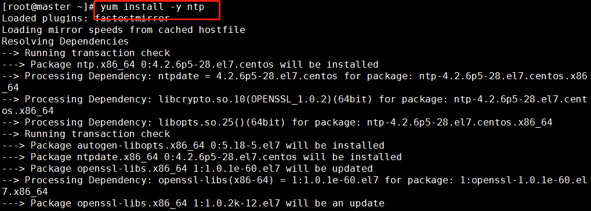    
4.master作为ntp服务器，修改ntp配置文件。（master上执行）    
　　默认的一个内部时钟数据，用在没有外部NTP服务器时，使用它为局域网用户提供服务：   

`vi /etc/ntp.conf`  

```
server  127.127.1.0               # local clock
fudge   127.127.1.0   stratum 10   #stratum设置为其它值也是可以的，其范围为0~15
```

   

重启ntp服务。   

`/bin/systemctl restart ntpd.service`  

5. 其他机器同步（slave1，slave2）    
等待大概五分钟，再到其他机上同步该机器时间。   

`ntpdate master`  

   

## 5.配置ssh免密  

SSH主要通过RSA算法来产生公钥与私钥，在数据传输过程中对数据进行加密来保障数据的安全性和可靠性，公钥部分是公共部分，网络上任一结点均可以访问，私钥主要用于对数据进行加密，以防他人盗取数据。总而言之，这是一种非对称算法，想要破解还是非常有难度的。Hadoop集群的各个结点之间需要进行数据的访问，被访问的结点对于访问用户结点的可靠性必须进行验证，hadoop采用的是ssh的方法通过密钥验证及数据加解密的方式进行远程安全登录操作，当然，如果hadoop对每个结点的访问均需要进行验证，其效率将会大大降低，所以才需要配置SSH免密码的方法直接远程连入被访问结点，这样将大大提高访问效率。     
    1. 每个结点分别产生公私密钥：

`ssh-keygen -t dsa -P '' -f ~/.ssh/id_dsa`（三台机器）     
秘钥产生目录在用户主目录下的.ssh目录中，进入相应目录查看：`cd .ssh/`         
     
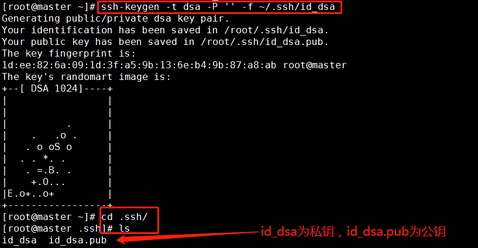  

2.Id_dsa.pub为公钥，id_dsa为私钥，紧接着将公钥文件复制成authorized_keys文件：（仅在master机器上操作）     
        
`cat id_dsa.pub >> authorized_keys`（注意在.ssh/路径下操作）

   

　在主机上连接自己，也叫做ssh内回环。   

`ssh master`

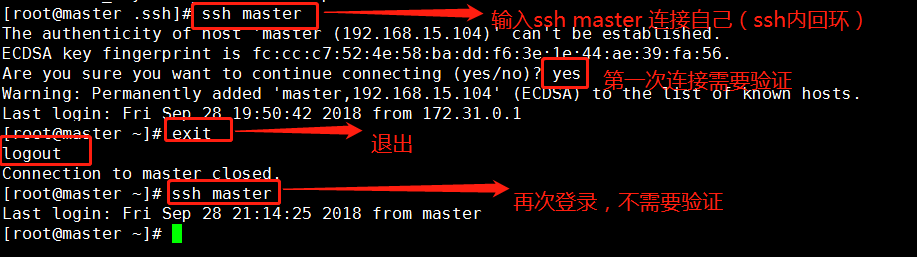   

2.让主结点master能通过SSH免密码登录两个子结点slave。（分别在slave1和slave2中操作）
　　为了实现这个功能，两个slave结点的公钥文件中必须要包含主结点的公钥信息，这样
　　当master就可以顺利安全地访问这两个slave结点了。
　　slave1结点通过scp命令远程登录master结点，并复制master的公钥文件到当前的目录下，且重命名为master_dsa.pub，这一过程需要密码验证。
首先需要分别打开slave1节点和slave2节点的 .ssh文件夹：

`cd .ssh`

`scp master:~/.ssh/id_dsa.pub ./master_dsa.pub`  

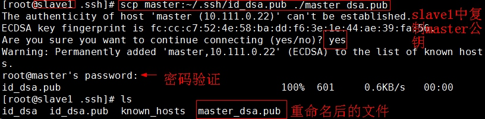   

将master结点的公钥文件追加至authorized_keys文件。   

`cat master_dsa.pub >> authorized_keys`   
  

这时，master就可以连接slave1了。  

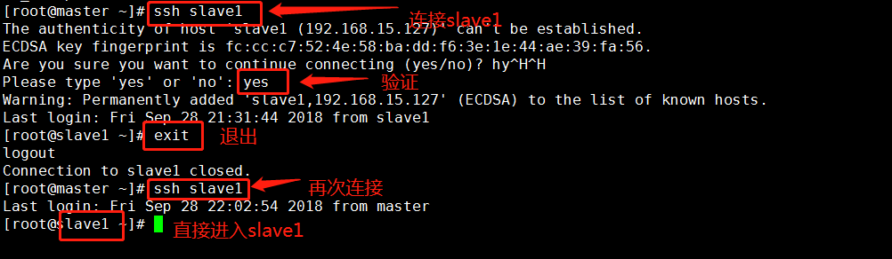  

slave1结点首次连接时需要，“yes”确认连接，这意味着master结点连接slave1结点时需要人工询问，无法自动连接，输入yes后成功接入，紧接着注销退出至master结点。    

　　同理slave2中也是这么操作。     

　　注意：两个结点的ssh免密码登录已经配置成功，还需要对主结点master也要进行上面的同样工作，因为jobtracker有可能会分布在其它结点上，jobtracker有不存在master结点上的可能性。在上一步骤中，我们已经进行过此操作，这里仅做提醒。    

## ６．安装JDK  


1.首先在根目录下建立工作路径/usr/java

```
mkdir -p /usr/java
tar -zxvf /opt/soft/jdk-8u171-linux-x64.tar.gz -C /usr/java/
```   
     

2.修改环境变量     
　　修改环境变量：`vi /etc/profile`

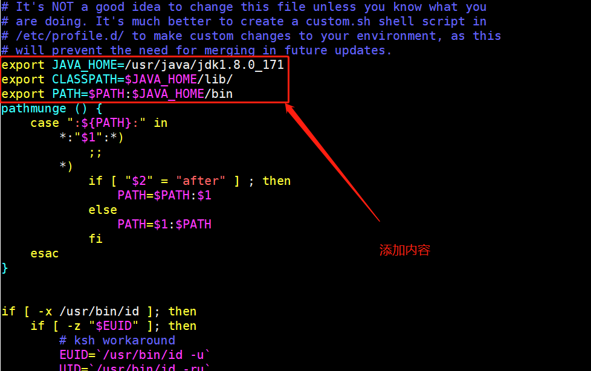   

添加内容如下：

```
export JAVA_HOME=/usr/java/jdk1.8.0_171
export CLASSPATH=$JAVA_HOME/lib/
export PATH=$PATH:$JAVA_HOME/bin
export PATH JAVA_HOME CLASSPATH
```   

生效环境变量：`source /etc/profile`     
查看java版本：`java -version`   

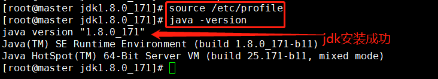   

在master节点操作成功后可以使用远程复制命令将JDK远程复制到slave1和slave2节点在中：（此命令在master中操作）   

```
scp -r /usr/java root@slave1:/usr/
scp -r /usr/java root@slave2:/usr/
```

   

接下来操作slave1和slave2，配置java的环境变量：   

修改环境变量：vi /etc/profile   

添加内容如下：   

```
export JAVA_HOME=/usr/java/jdk1.8.0_171
export CLASSPATH=$JAVA_HOME/lib/
export PATH=$PATH:$JAVA_HOME/bin
export PATH JAVA_HOME CLASSPATH
```

生效环境变量：`source /etc/profile`    
注意：在操作完slave1和slave2之后需要更新环境变量之后才可以使用`java -version`去查看JDK的版本。    

## 7.安装zookeeper  

1. 修改主机名称到IP地址映射配置。
    
```
vi /etc/hosts
192.168.15.104 master master.root
192.168.15.127 slave1 slave1.root
192.168.15.124 slave2 slave2.root
```

2. 修改ZooKeeper配置文件。在其中一台机器（master）上，用tar -zxvf 命令解压缩zookeeper-3.4.6.tar.gz。解压缩zookeeper-3.4.6.tar.gz     
首先创建zookeeper的工作路径：    

`mkdir -p /usr/zookeeper`   

然后解压zookeeper到刚才创建的zookeeper的工作路径中：

`tar –zxvf /opt/soft/zookeeper-3.4.10.tar.gz –C /usr/zookeeper`

3. 配置文件conf/zoo.cfg，用cd命令进入zookeeper-3.4.10/conf目录下，将zoo_sample.cfg文件拷贝一份，命名为为“zoo.cfg”。

`cp zoo_sample.cfg zoo.cfg`  zoo.cfg文件配置

```
tickTime=2000
initLimit=10
syncLimit=5
dataDir=/usr/zookeeper/zookeeper-3.4.10/zkdata
clientPort=2181
dataLogDir=/usr/zookeeper/zookeeper-3.4.10/zkdatalog
server.1=master:2888:3888
server.2=slave1:2888:3888
server.3=slave2:2888:3888
```

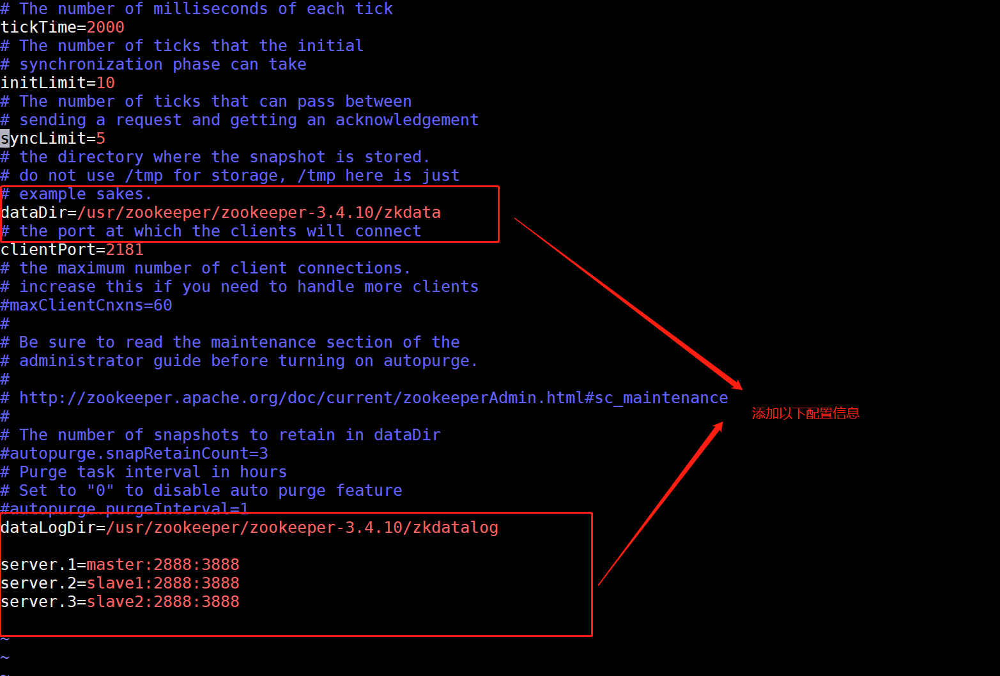   

4. 在zookeeper的目录中，创建zkdata和zkdatalog两个文件夹。Zkdatalog文件夹，是为了指定zookeeper产生日志指定相应的路径

`mkdir zkdata`
`mkdir zkdatalog`
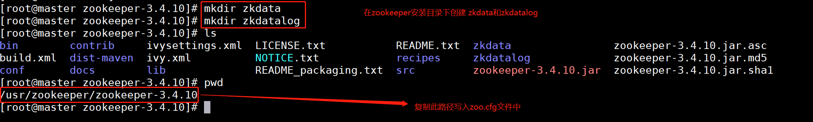   
5. 进入zkdata文件夹，创建文件myid。
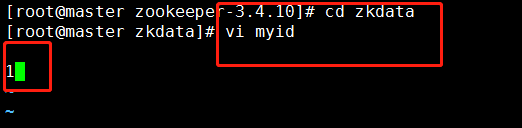

6. 远程复制分发安装文件    
上面已经在一台机器master上配置完成ZooKeeper，现在可以将该配置好的安装文件远程拷贝到集群中的各个结点对应的目录下：

`scp -r /usr/zookeeper root@slave1:/usr/`
`scp -r /usr/zookeeper root@slave2:/usr/`

7. 设置myid。在我们配置的dataDir指定的目录下面，创建一个myid文件，里面内容为一个数字，用来标识当前主机，conf/zoo.cfg文件中配置的server.X中X为什么数字，则myid文件中就输入这个数字。


`cd /usr/zookeeper/zookeeper-3.4.10/zkdata`
　　slave1中为2；
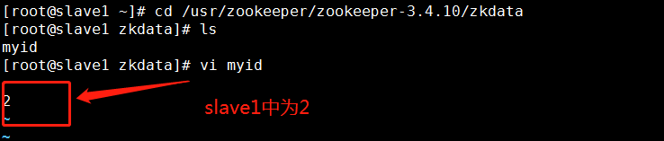


　　slave2中为3；
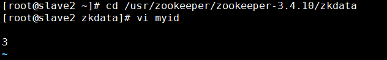

8. 配置环境变量并启动ZooKeeper。在每台机器上的 `/etc/profile`

`vi /etc/profile`

```
#set zookeeper environment    
export ZOOKEEPER_HOME=/usr/zookeeper/zookeeper-3.4.10 
PATH=$PATH:$ZOOKEEPER_HOME/bin
```
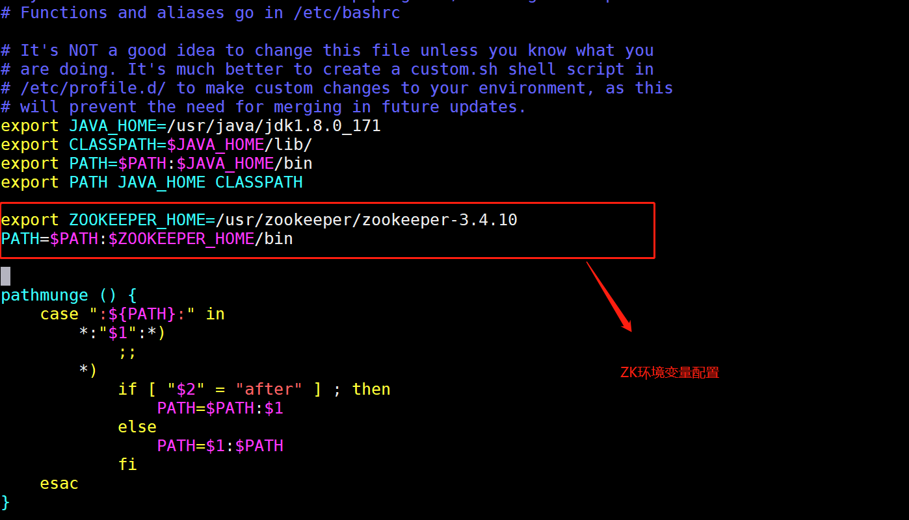
生效：`source /etc/profile`

9. 启动ZooKeeper集群      
在ZooKeeper集群的每个结点上，执行启动ZooKeeper服务的脚本，如下所示：

```
bin/zkServer.sh start
bin/zkServer.sh status
```

master 节点上启动并查看zookeeper状态：  


slave1节点上启动并查看zookeeper状态：
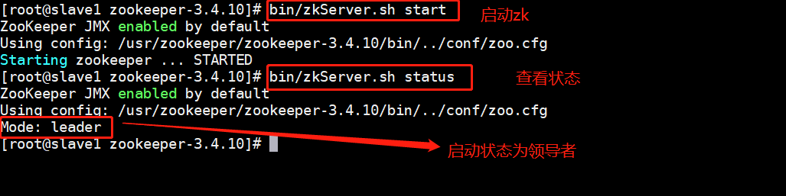

slave2 节点上启动并查看zookeeper状态：
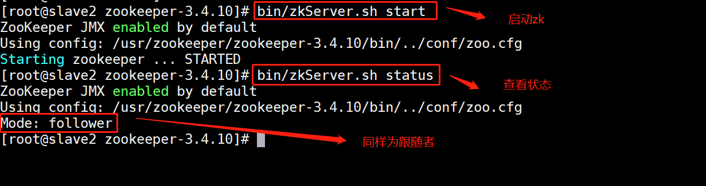

通过上面状态查询结果可见，一个节点是Leader，其余的结点是Follower。


# 数据分析     

## 使用hive对数据进行操作  

### 修改host
* 首先修改三个节点的hosts文件，在配置文件后保存并退出：
* 命令 `vim /etc/hosts`
* 加入三台机器的ip（以具体实验中机器的ip地址为准）      

***分发到剩下两个机器！！！！！！！！***
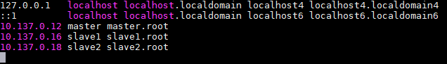  

### 开启zookeeper

* 接下来进入zookeeper的安装目录，开启zookeeper（三台机器都需要启动）：
* 命令（打开zookeeper安装目录）：`cd /usr/zookeeper/zookeeper-3.4.10/`
* 命令（开启zookeeper服务）：`bin/zkServer.sh start`  

### 开启hadoop
* 首先打开hadoop安装目录（仅在master上执行）：
* 命令（打开hadoop安装目录）：`cd /usr/hadoop/hadoop-2.7.3/`
* 命令（开启hadoop）`sbin/start-all.sh`   

### 开启hbase   

* 进入到hbase安装目录，开启hbase（仅在master上执行）
* 命令（打开hbase安装目录）：`cd /usr/hbase/hbase-1.2.4/`
* 命令（开启hbase）：`bin/start-hbase.sh`


### 开启hive
* 首先进入到hive的安装目录，修改配置文件，最后启动hive server（在slave1中执行）：    
* 命令（打开slave1节点上的hive安装目录）：`cd /usr/hive/apache-hive-2.1.1-bin/conf/`
命令       
* （编辑slave1中的hive-site.xml配置文件）：`vim hive-site.xml`
操作结果如下图所示：

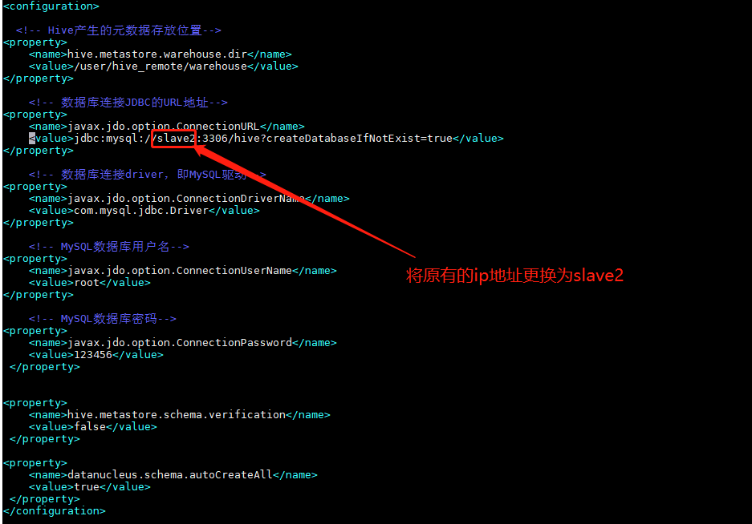  

接下来修改master中的hive-site.xml文件：      
命令（打开master节点上的hive安装目录）：`cd /usr/hive/apache-hive-2.1.1-bin/conf/`       
命令（编辑master中的hive-site.xml配置文件）：`vim hive-site.xml`      
将原有配置文件中的所有内容删除（可以使用快捷键 dd 去删除整行配置文件）     

然后输入一下配置文件：

```xml
<configuration>
  <!-- Hive产生的元数据存放位置-->
<property>
    <name>hive.metastore.warehouse.dir</name>
    <value>/user/hive_remote/warehouse</value>
</property>
    <!--- 使用本地服务连接Hive,默认为true-->
<property>
    <name>hive.metastore.local</name>
    <value>false</value>
</property>
    <!-- 连接服务器-->
<property>
    <name>hive.metastore.uris</name>
<value>thrift://slave1:9083</value>
</property>
</configuration>
```

最后保存退出即可，然后在slave1节点的hive安装目录下输入：`bin/hive --service metastore`    
 开启hive服务    
接下来在master节点中的hive安装目录下输入：`bin/hive`    
准备开启hive客户端     
但是此时程序报错，接下来将带大家解决一下错误：

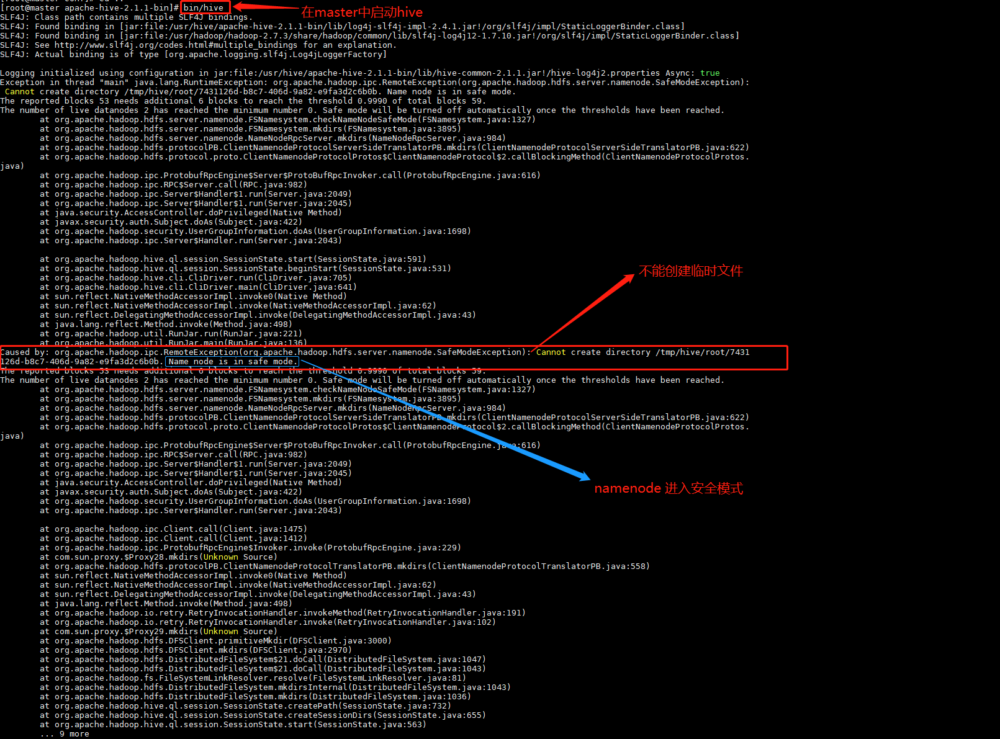   

可以看到此错误为hadoop进入安全模式，所以我们需要将hadoop退出安全模式，此错误很可能是集群意外中断所导致，我们可以通过一下命令去退出hadoop的安全模式：    
命令（进入master的hive安装目录）：`cd /usr/hive/apache-hive-2.1.1-bin/conf/`    
命令（退出hadoop安全模式）：`bin/hadoop dfsadmin -safemode leave`、
最后hive成功开启

1.查看数据库：   

```sql
create database hongya;
show databases;
use hongya;
```

2.创建表  

```sql
create table match_data(user_id int,age_range int,gender int, merchant_id int, label int, activity_log varchar(1000)) row format delimited fields terminated by ',';
```

加载数据
```sql
load data local inpath '/root/train_format2.csv' overwrite into table match_data;
select * from match_data limit 100;
```
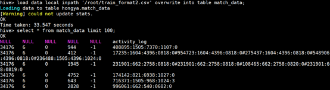    
创建结果表

```sql
CREATE TABLE RESULT AS
SELECT USER_ID,
SPLIT(LOG_SPLIT,':')[0] AS ITEM_ID,
SPLIT(LOG_SPLIT,':')[2] AS BRAND_ID,
SPLIT(LOG_SPLIT,':')[4] AS ATIION_TYPE
FROM (SELECT USER_ID,LOG_SPLIT
FROM match_data
LATERAL VIEW EXPLODE(SPLIT(ACTIVITY_LOG,'#')) ACTIVITY_LOG AS LOG_SPLIT ) T1
;
```   
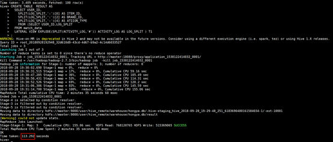   

`select * from RESULT limit 100;`    

创建点击表   

```sql
CREATE TABLE CLICK AS
SELECT ITEM_ID,COUNT(1) COUNT_1
FROM RESULT
WHERE ATIION_TYPE = '0'
GROUP BY ITEM_ID
ORDER BY COUNT_1 DESC
LIMIT 100;
```

`select * from click;`

加入购物车表   
```sql 
CREATE TABLE ADD_TO_CART AS
SELECT ITEM_ID,COUNT(1) COUNT_1
FROM RESULT
WHERE ATIION_TYPE = '1'
GROUP BY ITEM_ID
ORDER BY COUNT_1 DESC
LIMIT 100 ;

```

收藏表 

```sql
CREATE TABLE COLLECT AS
SELECT ITEM_ID,COUNT(1) COUNT_1
FROM RESULT
WHERE ATIION_TYPE = '3'
GROUP BY ITEM_ID
ORDER BY COUNT_1 DESC
LIMIT 100;
```

购买欲望表  
创建click_emp,写入商品点击购买转化率top10(点击转化率较高，建议top1000)   

```sql
CREATE TABLE EMPTION AS
SELECT ITEM_ID,COUNT(1) COUNT_1
FROM RESULT
WHERE ATIION_TYPE = '2'
GROUP BY ITEM_ID
ORDER BY COUNT_1 DESC
```


2.创建表add_emp，写入商品加入购物车-购买转化率top10

```sql
CREATE TABLE ADD_EMP AS
SELECT ITEM_ID,SUM(IF(ATIION_TYPE = '1',1,0))/COUNT(1) CLICK_EMP_RATE
FROM RESULT T1
GROUP BY ITEM_ID
ORDER BY CLICK_EMP_RATE DESC;
```
